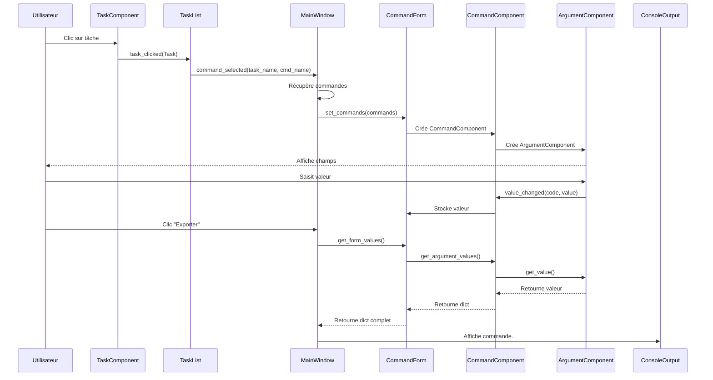

# CommandBuilder

**Fonctionnalités clés :**
- Interface utilisateur moderne avec thème sombre
- Définition des commandes via des fichiers YAML
- Validation des entrées utilisateur
- Générateur de commandes prêtes à l'exécution
- Support des arguments de différents types (fichier, dossier, nombre, etc.)
- Architecture modulaire et découplée
- Composants réutilisables et personnalisables

## Structure du Projet

```
command_builder/
├── assets/           # Ressources (icônes, images)
├── components/       # Composants UI modulaires
│   ├── task_component/     # Affichage d'une tâche
│   ├── argument_component/ # Gestion des arguments avec validation
│   ├── command_component/  # Affichage d'une commande et ses arguments
│   ├── task_list/          # Liste des tâches disponibles
│   ├── command_form/       # Formulaire de commandes
│   └── console_output/     # Affichage des sorties console
├── data/             # Définitions YAML
│   ├── commands/     # Commandes individuelles
│   └── tasks/        # Tâches (groupes de commandes)
├── models/           # Modèles de données
└── services/         # Logique métier
```

## Architecture

### Vue d'ensemble

graph TD
    A[MainWindow] --> B[TaskList]
    A --> C[CommandForm]
    B --> D[TaskComponent]
    C --> E[CommandComponent]
    E --> F[ArgumentComponent]


graph TB
    subgraph "Point d'Entrée"
        Main[main.py]
        YamlLoader[YamlTaskLoader]
    end
    
    subgraph "Fenêtre Principale"
        MainWindow[MainWindow]
    end
    
    subgraph "Composants Conteneurs"
        TaskList[TaskList]
        CommandForm[CommandForm]
        ConsoleOutput[ConsoleOutput]
    end
    
    subgraph "Composants Enfants"
        TaskComponent[TaskComponent]
        CommandComponent[CommandComponent]
        ArgumentComponent[ArgumentComponent]
    end
    
    subgraph "Modèles de Données"
        Task[Task]
        Command[Command]
        Argument[Argument]
    end
    
    subgraph "Injection de Dépendances"
        TaskFactory[task_widget_factory]
        CommandFactory[command_widget_factory]
    end

    %% Définition des styles
    classDef container fill:#4a9eff,stroke:#333,stroke-width:3px,color:#fff
    classDef factory fill:#90ee90,stroke:#333,stroke-width:2px
    
    %% Application des styles
    class TaskList,CommandForm container
    class TaskFactory,CommandFactory factory
    
    %% Connexions
    Main -->|1. Charge| YamlLoader
    YamlLoader -->|2. Retourne 'List of Tasks'| Main
    Main -->|3. Crée| MainWindow
    Main -->|4. set_tasks| MainWindow
    
    MainWindow -->|5. Contient| TaskList
    MainWindow -->|6. Contient| CommandForm
    MainWindow -->|7. Contient| ConsoleOutput
    
    TaskList -.->|Injection optionnelle| TaskFactory
    TaskFactory -.->|Crée| TaskComponent
    TaskList -->|Par défaut crée| TaskComponent
    
    CommandForm -.->|Injection optionnelle| CommandFactory
    CommandFactory -.->|Crée| CommandComponent
    CommandForm -->|Par défaut crée| CommandComponent
    
    CommandComponent -->|Contient N| ArgumentComponent
    
    %% Légende
    legend[Legende]
    legend --> container[Conteneur]
    legend --> factory[Factory]

### Flux d'Exécution



### Responsabilités des Composants

#### **main.py** (Point d'entrée)
- Initialise l'application Qt
- Charge les tâches depuis YAML
- Crée et affiche la fenêtre principale

#### **MainWindow** (Orchestrateur)
- Contient tous les composants principaux
- Coordonne la communication entre composants
- Gère les événements globaux (menus, actions)
- Connecte les signaux entre TaskList et CommandForm

#### **TaskList** (Conteneur découplé)
- Affiche une liste de tâches
- Gère le tri des tâches
- Crée des widgets enfants via factory
- Émet des signaux quand une tâche est sélectionnée

####  **CommandForm** (Conteneur découplé)
- Affiche une liste de commandes
- Gère l'affichage en mode simple/complet
- Crée des widgets enfants via factory
- Collecte les valeurs des arguments

#### **TaskComponent** (Widget enfant)
- Affiche UNE tâche (bouton cliquable)
- Émet signal `task_clicked(Task)`
- Gère son propre style (.ui, .qss)

#### **CommandComponent** (Widget enfant)
- Affiche UNE commande (simple/complet)
- Crée des ArgumentComponent
- Collecte les valeurs des arguments

#### **ArgumentComponent** (Widget enfant)
- Affiche UN argument (champ de saisie)
- Gère la validation
- Bouton parcours pour fichiers/dossiers

## Installation

```bash
# 1. Installer les dépendances
pipenv install

# 2. Lancer l'application
task dev
```

## Utilisation

1. **Définir des commandes** dans `data/commands/` :

```yaml
# exemple.yaml
name: "Ma commande"
command: "commande --input {fichier} --option {valeur}"
arguments:
  - code: "fichier"
    name: "Fichier source"
    type: "file"
    required: true
  
  - code: "valeur"
    name: "Option"
    type: "number"
    default: "42"
```

2. **Créer des tâches** dans `data/tasks/` :

```yaml
# ma_tache.yaml
name: "Ma tâche"
commands:
  - !include ../commands/exemple.yaml
```

3. **Types d'arguments** :
   - `text` : Champ texte
   - `file` : Sélecteur de fichier
   - `directory` : Sélecteur de dossier
   - `number` : Nombre
   - `boolean` : Case à cocher
   - `select` : Liste déroulante

## Bonnes pratiques

1. **Organisation des commandes :**
   - Une commande = un fichier YAML
   - Nommer les fichiers de manière descriptive
   - Grouper les commandes liées dans des sous-dossiers

2. **Gestion des arguments :**
   - Toujours définir un `name` et une `description` claire
   - Utiliser `required: true` pour les arguments obligatoires
   - Définir des valeurs par défaut quand c'est pertinent

3. **Conseils de performance :**
   - Éviter les commandes trop complexes
   - Privilégier plusieurs commandes simples plutôt qu'une seule complexe
   - Tester régulièrement les commandes générées

## Développement

### Commandes utiles

```bash
# Lancer les tests
pytest

# Vérifier le style
ruff check .
black .

# Créer l'exécutable
task build

# Nettoyer les fichiers temporaires
task clean
```

### Structure recommandée pour les commandes

```yaml
# command_builder/data/commands/analyse/tdms_import.yaml
name: "Importer TDMS"
description: "Importe un fichier TDMS pour analyse"
command: "tdms_import --input {input_file} --output {output_dir}"
arguments:
  - code: "input_file"
    name: "Fichier source"
    description: "Sélectionnez le fichier .tdms à importer"
    type: "file"
    required: true
    filters: "*.tdms"  # Filtre d'extension de fichier
    
  - code: "output_dir"
    name: "Dossier de sortie"
    description: "Dossier où enregistrer les résultats"
    type: "directory"
    default: "./output"
```

### Débogage

- Activer les logs détaillés :
  ```bash
  set LOG_LEVEL=DEBUG
  task dev
  ```
- Vérifier le fichier `logs/command_builder.log` en cas d'erreur
